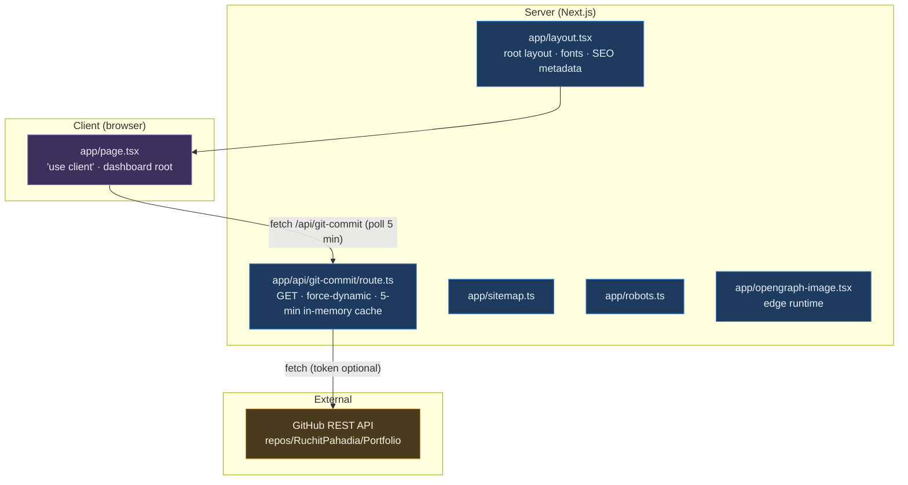
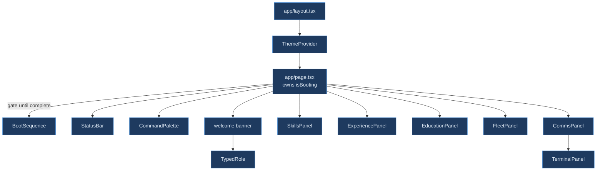
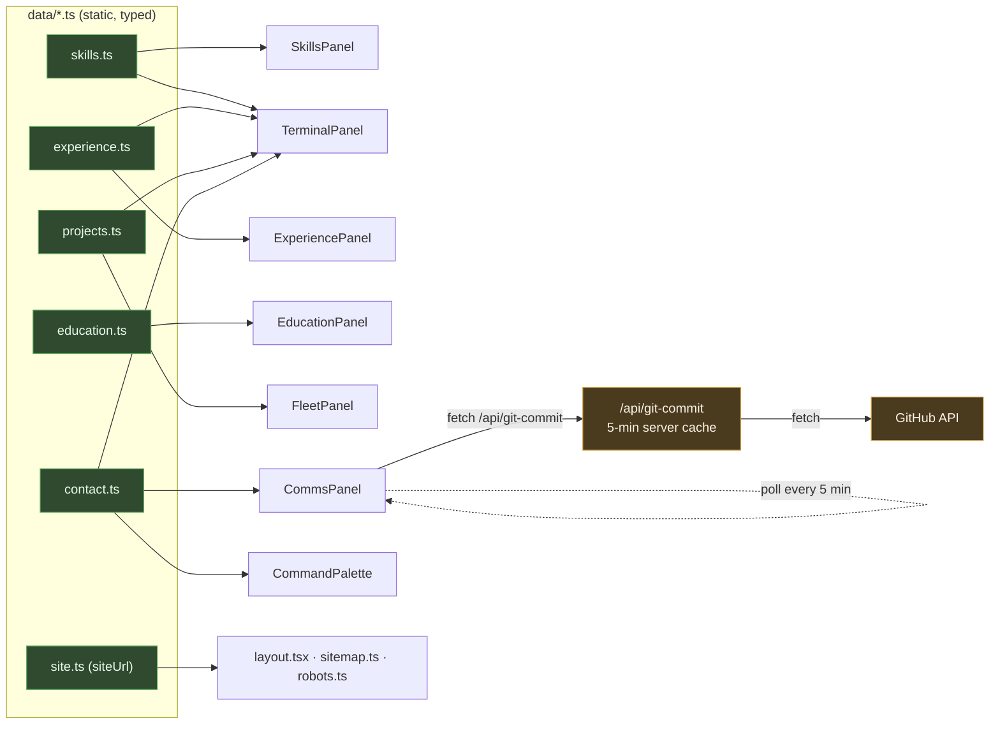
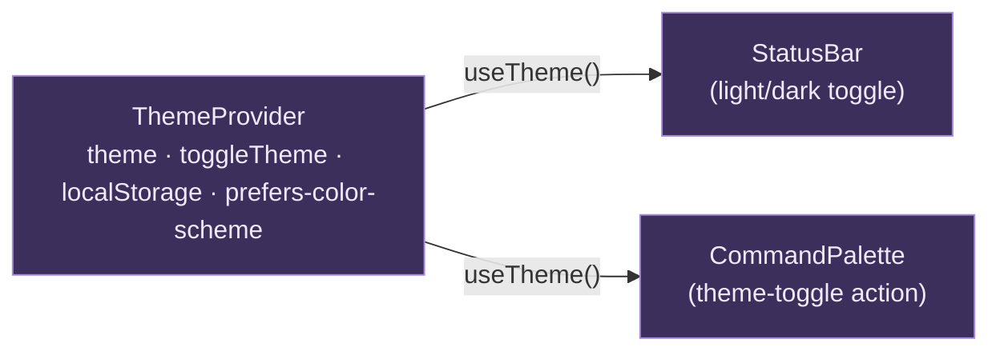

# Architecture

A visual map of **Presonal_Dashboard** — a single-page portfolio for Ruchit Pahadia, built as a
"mission-control telemetry dashboard."

**Stack:** Next.js 16.2.12 (App Router) · React 19.2.4 · Tailwind CSS v4 · Framer Motion 12 · lucide-react ·
TypeScript 5.

**Shape:** one client-rendered page (`app/page.tsx`) gated behind a boot animation, composed of ~10 dashboard
panels. One API route (`/api/git-commit`) proxies the GitHub API for live commit telemetry. All content lives
in seven static, typed `data/*.ts` modules. A single React context (`ThemeProvider`) drives light/dark.

> Diagrams below are [Mermaid](https://mermaid.js.org/) and render inline on GitHub and in Mermaid-aware editors.

---

## 1. System overview

Server / client / external boundaries, and the one dynamic data path.

---

## 2. Component tree

What `app/page.tsx` mounts, plus the legacy code that ships in the repo but is never rendered.

> The repo previously carried a second, unused generation of components (a scrolling-page portfolio:
> `Hero`, `About`, `Navbar`, `Contact`, `Footer`, `ResumeModal`, the old `Skills`/`Experience`/`Education`/
> `Projects`/`GithubSection`, and the unwired `dashboard/SignalPanel.tsx`). These — plus the orphaned
> `data/hero.ts` and `data/about.ts` — were removed during cleanup (see `IMPROVEMENTS.md` P1.1). Everything
> above is now the entire live component set.

---

## 3. Data flow

All content is static, typed TypeScript in `data/*.ts`, imported by panels at build time. The only runtime
data path is the GitHub commit telemetry.

> Content is single-sourced from `data/`: `TerminalPanel` reads `skills.ts` and `CommandPalette` reads
> `contact.ts` (both previously hardcoded — fixed in `IMPROVEMENTS.md` P1.2). `site.ts` centralizes the
> deployed URL, overridable via `NEXT_PUBLIC_SITE_URL`.

---

## 4. Theme context

One provider, two consumers.

---

## Notes

- **Single live component set.** `components/` now holds only `dashboard/*` and top-level `ThemeProvider`.
  The earlier unused scrolling-page generation and the superseded `SignalPanel` were removed during cleanup.
- **No `lib/` `utils/` `hooks/` `types/` dirs.** Shared types are co-located inside the `data/*.ts` modules.
- **Tailwind v4 has no config file** — theme tokens live in `app/globals.css`; PostCSS uses `@tailwindcss/postcss`.
- **Customized Next.js.** Per `AGENTS.md`, this is not stock Next.js 16 — consult `node_modules/next/dist/docs/`
  before changing framework-level code.

